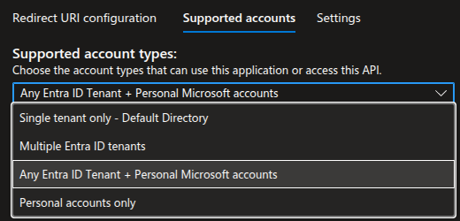
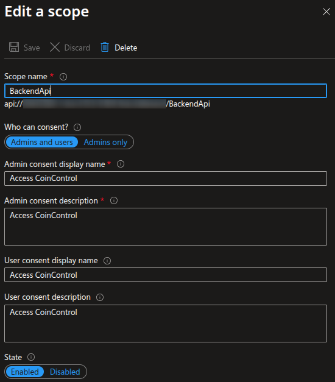
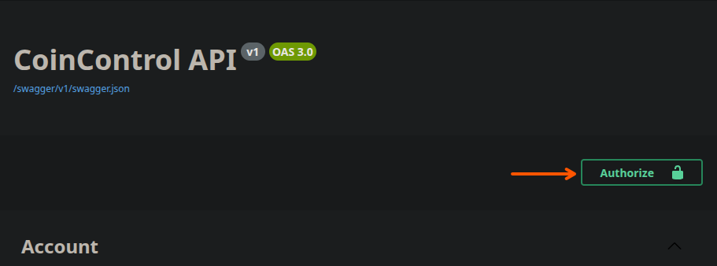
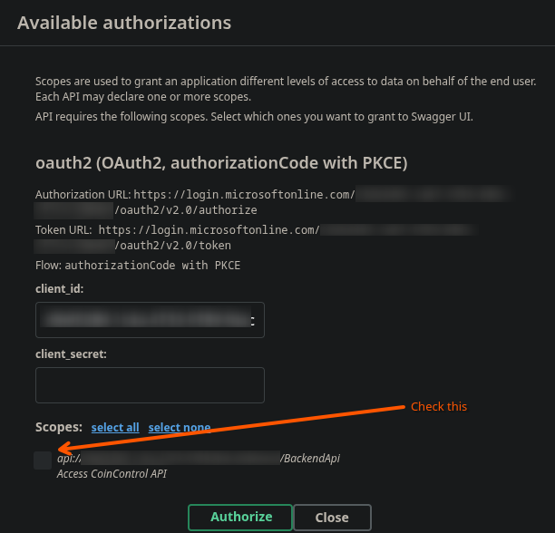

## Summary
Adding authentication to Dotnet WebApis is something I need to do often but I always find it a struggle. This is a guide for myself and anyone else to speed up the process.

I am planning to make this a git template so I never have to do this again!

## How it Works
First you must set up an App Registration in Entra and then you can add the detials to your code. In simple terms, we are telling the application to trust Microsoft and any user who has authenticated against Microsoft, providing the app is configured to allow them.

## Configuring Your App in Entra
I'm not going to go into how to create an Entra Tenant itself. This guide assumes you have already created an App Registration with the name of the Application you are creating.

- Navigate to the App Registration on the "App Registrations" page (not the "Enterprise Applications" page)
- If using Swagger, under "Authentication" configure Redirect URI for a Single-page Application:


*Ignore the top URL*

- Sill under "Authentication", select the "Supported accounts" tab and choose the correct option:


*I use "Any Entra ID Tenant + Personal Microsoft accounts"*

*Note: If you receive an error "Error detail: Property api.requestedAccessTokenVersion is invalid.", go to the "Manifest" page, and change "requestedAccessTokenVersion" to the value "2", save, then try again*

- Under "Expose an API" add a scope. Give hte scope a valid name for example, "BackendApi":

*This is an example from personal finance budgetting app I'm working on called "CoinControl"*

That's it! You may also want to navigate to the Enterprise Application and configure hte properties to limit the users who have access, however this completely depends on your requirements.

## Updating The Code
### Adding Authorization in C#
- Install the Microsoft Identity Web package from the CLI: `dotnet add package Microsoft.Identity.Web`
- Fill in the below with the details from Entra and add it to your `appsettings.json` file:
```json
{
    "Project": {
        "Name": "TODO"
    },
    "Entra": {
        "Instance": "https://login.microsoftonline.com",
        "ClientId": "TODO",
        "TenantId": "TODO"
    }
}
```
- In `program.cs`, below `var builder = WebApplication.CreateBuilder(args)`, add the below:
```csharp
	var projectName = builder.Configuration["Project:Name"];
    var clientId = builder.Configuration["Entra:ClientId"];
    var tenantId = builder.Configuration["Entra:TenantId"];
    var scope = $"api://{clientId}/BackendApi";
```
- Just above `var app = builder.Build();` add the below:
```csharp
builder.Services.AddAuthentication(JwtBearerDefaults.AuthenticationScheme)
    .AddMicrosoftIdentityWebApi(builder.Configuration.GetSection("Entra"));
```
- Under `app.UseHttpsRedirection();` add the below:
```csharp
    app.UseCors();
    app.UseAuthentication();
    app.UseAuthorization(); // If not already there...
```
- On your Controllers, import the `Microsoft.AspNetCore.Authorization` library and then add the `[Authorize]` flag. For example:
```csharp
    using Microsoft.AspNetCore.Authorization;

    // Lots of other stuff...

    [HttpGet(Name = "GetWeatherForecast")]
    [Authorize] // Add this
    public IEnumerable<WeatherForecast> Get()
    {
        // Etc
    }
```

Now the API calls will only work when you the Entra token is added with the API call.

### Adding Authorization Options in Swagger
#### Implementation
*Note: Before adding Swagger you have to have already done the steps in [Adding Swagger to C# API Projects](../AddingSwaggerToCSharpApiProjects)*

- Change `builder.Services.AddSwaggerGen();`, change to the below:

```csharp
builder.Services.AddSwaggerGen(options =>
{
    options.SwaggerDoc("v1", new OpenApiInfo { Title = $"{projectName} API", Version = "v1" });

    options.AddSecurityDefinition("oauth2", new OpenApiSecurityScheme
    {
        Type = SecuritySchemeType.OAuth2,
        Flows = new OpenApiOAuthFlows
        {
            AuthorizationCode = new OpenApiOAuthFlow
            {
                AuthorizationUrl = new Uri($"https://login.microsoftonline.com/{tenantId}/oauth2/v2.0/authorize"),
                TokenUrl = new Uri($"https://login.microsoftonline.com/{tenantId}/oauth2/v2.0/token"),
                Scopes = new Dictionary<string, string>
                {
                    { scope, $"Access {projectName} API" }
                }
            }
        }
    });

    options.AddSecurityRequirement(new OpenApiSecurityRequirement
    {
        {
            new OpenApiSecurityScheme
            {
                Reference = new OpenApiReference
                {
                    Type = ReferenceType.SecurityScheme,
                    Id = "oauth2"
                }
            },
            new[] { scope }
        }
    });
});
```
#### Usage
So now you want to actually test your API endpoint from Swagger, how do we do this?

If you implemented the above it's not bad at all!

- Navigate to the `/swagger` endpoint
- Click the "Authorize" button at the top right



- In the popup window, enable the scopes and select "Authorize"
 


You will then be taken to the Entra page to login. When you come back you will be authorised for the rest of the session.

## Notes
This was specifically tested with the following packages:
- Microsoft.Identit.Web Vesrsion 4.4.0
- Swashbuckle.AspNetCore Version 6.9.1

## Full Example of Program.cs
Just in case my instructions above aren't working or missing anything:
``` csharp
using System.Security.Cryptography.Xml;
using Microsoft.AspNetCore.Authentication.JwtBearer;
using Microsoft.Identity.Web;
using Microsoft.OpenApi.Models;

var builder = WebApplication.CreateBuilder(args);

// Log from AppSettings.Json
var projectName = builder.Configuration["Project:Name"];
var clientId = builder.Configuration["Entra:ClientId"];
var tenantId = builder.Configuration["Entra:TenantId"];
var scope = $"api://{clientId}/BackendApi";

// Add services to the container.

builder.Services.AddControllers();
builder.Services.AddEndpointsApiExplorer();
builder.Services.AddSwaggerGen(options =>
{
    options.SwaggerDoc("v1", new OpenApiInfo { Title = $"{projectName} API", Version = "v1" });

    options.AddSecurityDefinition("oauth2", new OpenApiSecurityScheme
    {
        Type = SecuritySchemeType.OAuth2,
        Flows = new OpenApiOAuthFlows
        {
            AuthorizationCode = new OpenApiOAuthFlow
            {
                AuthorizationUrl = new Uri($"https://login.microsoftonline.com/{tenantId}/oauth2/v2.0/authorize"),
                TokenUrl = new Uri($"https://login.microsoftonline.com/{tenantId}/oauth2/v2.0/token"),
                Scopes = new Dictionary<string, string>
                {
                    { scope, $"Access {projectName} API" }
                }
            }
        }
    });

    options.AddSecurityRequirement(new OpenApiSecurityRequirement
    {
        {
            new OpenApiSecurityScheme
            {
                Reference = new OpenApiReference
                {
                    Type = ReferenceType.SecurityScheme,
                    Id = "oauth2"
                }
            },
            new[] { scope }
        }
    });
});

// Auth
builder.Services.AddAuthentication(JwtBearerDefaults.AuthenticationScheme)
    .AddMicrosoftIdentityWebApi(builder.Configuration.GetSection("Entra"));

builder.Services.AddAuthorization();

builder.Services.AddCors(options =>
{
    options.AddDefaultPolicy(policy =>
    {
        policy.AllowAnyOrigin()
            .AllowAnyHeader()
            .AllowAnyMethod();
    });
});

var app = builder.Build();

// Configure the HTTP request pipeline.
if (app.Environment.IsDevelopment())
{
    app.UseSwagger();

    app.UseSwaggerUI(options =>
    {
        options.SwaggerEndpoint("/swagger/v1/swagger.json", $"{projectName} API v1");
        options.OAuthClientId(clientId);
        options.OAuthUsePkce();
        options.OAuthScopeSeparator(" ");
        options.DisplayOperationId();
    });
}

app.UseHttpsRedirection();

// Auth and Cors
app.UseCors();
app.UseAuthentication();
app.UseAuthorization();

app.MapControllers();

app.Run();
```

## Troubleshooting
My app broke when I changed the App Registration to trust users from my Tenant to any Tenant! To get round this AI told me to add this to support all tenants:

```csharp
// This bit was already here - Just to show you where to put hte below
builder.Services.AddAuthentication(JwtBearerDefaults.AuthenticationScheme)
.AddMicrosoftIdentityWebApi(builder.Configuration.GetSection("Entra"));

// This bit is the new bit which tells it to trust all these URLs:
builder.Services.Configure<MicrosoftIdentityOptions>(options =>
{
    options.Authority = "https://login.microsoftonline.com/common/v2.0";
    options.TokenValidationParameters.ValidIssuers = new[]
    {
        "https://login.microsoftonline.com/common/v2.0",
        "https://login.microsoftonline.com/{tenantid}/v2.0",
        "https://sts.windows.net/{tenantid}/"
    };
    options.TokenValidationParameters.ValidAudience = clientId;
});
```
## Full Example of Program.cs for Multi Tenants:
```csharp
using Microsoft.AspNetCore.Authentication.JwtBearer;
using Microsoft.Identity.Web;
using Microsoft.OpenApi.Models;
using Microsoft.EntityFrameworkCore;
using Infrastructure.Data;

var builder = WebApplication.CreateBuilder(args);

// AppSettings.Json
var projectName = builder.Configuration["Project:Name"];
var clientId = builder.Configuration["Entra:ClientId"];
var tenantId = builder.Configuration["Entra:TenantId"];
var scope = $"api://{clientId}/BackendApi";

var connectionString = builder.Configuration.GetConnectionString(builder.Environment.EnvironmentName);

// Add services to the container.

builder.Services.AddControllers();
builder.Services.AddEndpointsApiExplorer();
builder.Services.AddDbContext<AppDbContext>(options => options.UseNpgsql(connectionString));

// Swagger
builder.Services.AddSwaggerGen(options =>
{
    options.SwaggerDoc("v1", new OpenApiInfo { Title = $"{projectName} API", Version = "v1" });

    options.AddSecurityDefinition("oauth2", new OpenApiSecurityScheme
    {
        Type = SecuritySchemeType.OAuth2,
        Flows = new OpenApiOAuthFlows
        {
            AuthorizationCode = new OpenApiOAuthFlow
            {
                AuthorizationUrl = new Uri($"https://login.microsoftonline.com/{tenantId}/oauth2/v2.0/authorize"),
                TokenUrl = new Uri($"https://login.microsoftonline.com/{tenantId}/oauth2/v2.0/token"),
                Scopes = new Dictionary<string, string>
                {
                    { scope, $"Access {projectName} API" }
                }
            }
        }
    });

    options.AddSecurityRequirement(new OpenApiSecurityRequirement
    {
        {
            new OpenApiSecurityScheme
            {
                Reference = new OpenApiReference
                {
                    Type = ReferenceType.SecurityScheme,
                    Id = "oauth2"
                }
            },
            new[] { scope }
        }
    });
});

// Auth
builder.Services.AddAuthentication(JwtBearerDefaults.AuthenticationScheme)
    .AddMicrosoftIdentityWebApi(builder.Configuration.GetSection("Entra"));

// Allow multi-tenant issuer validation
builder.Services.Configure<MicrosoftIdentityOptions>(options =>
{
    options.Authority = "https://login.microsoftonline.com/common/v2.0";
    options.TokenValidationParameters.ValidIssuers = new[]
    {
        "https://login.microsoftonline.com/common/v2.0",
        "https://login.microsoftonline.com/{tenantid}/v2.0",
        "https://sts.windows.net/{tenantid}/"
    };
    options.TokenValidationParameters.ValidAudience = clientId;
});

builder.Services.AddAuthorization();

builder.Services.AddCors(options =>
{
    options.AddDefaultPolicy(policy =>
    {
        policy.AllowAnyOrigin()
            .AllowAnyHeader()
            .AllowAnyMethod();
    });
});

var app = builder.Build();

// Configure the HTTP request pipeline.
if (app.Environment.IsDevelopment())
{
    app.UseSwagger();

    app.UseSwaggerUI(options =>
    {
        options.SwaggerEndpoint("/swagger/v1/swagger.json", $"{projectName} API v1");
        options.OAuthClientId(clientId);
        options.OAuthUsePkce();
        options.OAuthScopeSeparator(" ");
        options.DisplayOperationId();
    });
}

app.UseHttpsRedirection();

// Auth and Cors
app.UseCors();
app.UseAuthentication();
app.UseAuthorization();

app.MapControllers();

app.Run();
```