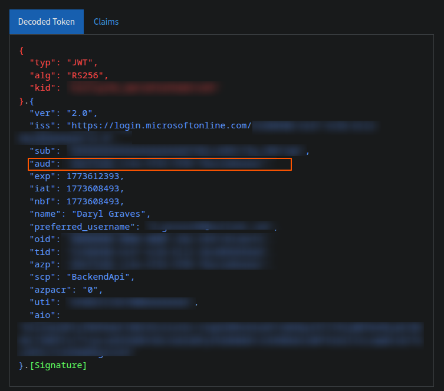

## Summary
I have literally lost the best part of two evenings trying to get Microsoft Authentication working on a new Vue JS frontend app so I'm documenting it here... I did managed to get it working previously and I remember it being so easy but I really had some issues this time which knocked my confidence. 

It actually turned out to be a bug in the latest version of the `msal-browser` library... Instead of closing the popup window it was redirecting to my app in the tiny popup box... Once I downgraded to v4.13.0 it worked! But I still wanted to document this as there isn't much on the internet about how to set this up specifically for Vue.js and I keep forgetting everytime I start a new project!

## Prerequisites
- An Entra App Registration
- A Vue.js App with the following libraries:
  - pinia
  - vue-router

I personally used the default Vuetify template (`npm create vuetify`) and choose the full package which automatically installs the Vue-Router and Pinia library in addition to some other libraries that aren't used (MCP and i18n).

## Configuring Entra
*Note: This is only the front end so you will need a backend for your API calls. I'd recommend following the Entra steps in [Microsoft Authentication In C# Web APIs](../AuthInCSharpWebApis) first, even if you are not using C# as your backend*

In your Entra App Registration:
- Navigate to the "Authentication" tab, add a "Single-page application" Redirect URI and enter the url:


- Sill under "Authentication", select the "Supported accounts" tab and choose the correct option for your use case:


*I use "Any Entra ID Tenant + Personal Microsoft accounts"*

*Note: If you receive an error "Error detail: Property api.requestedAccessTokenVersion is invalid.", go to the "Manifest" page, and change "requestedAccessTokenVersion" to the value "2", save, then try again*

*Note 2: Depending on your choice here, your code may need to be tweaked. The code below has been tested and worked on "Any Entra ID Tenant + Personal Microsoft accounts" but if you want your app locked down to just users on your Tenant, you may require some changes. For example, I think the login URL doesn't use `/common` but your Tenant Id instead. That said, I'm not 100% sure... Sorry, it's not clear cut!*

## The Code
### High Level Summary
We are about to:
- Add a file for our Environment Variables
- Add the `msal-browser` library to the project
- Create a Pinia store to store the user details, including their auth token
- Update the router so if the user doesn't yet have an auth token, it redirects them to the `/login` page
- Create the `/login` page
- Update `HelloWorld.vue` so when the user is logged in, it prints their name (so we can see it's working)

### Env File
Create an `.env` file with the following details completed from Entra:
```
VITE_CLIENTID=TODO
VITE_TENANTID=TODO
```

### Installing the Libraries
In your terminal, navigate to the repo and install the library by running `npm install @azure/msal-browser@4.13.0`

*Note: We are specifically using 4.13.0 because the latest version at the time of writing seems to be broken.*

### Configuring the Auth Store
Under `/src/stores/` create `auth.ts` and add the following:

``` typescript
import { PublicClientApplication, type AccountInfo } from "@azure/msal-browser";
import { reactive } from "vue";

const config = {
  auth: {
    clientId: import.meta.env.VITE_CLIENTID,
    authority: "https://login.microsoftonline.com/common", 
    redirectUri: `${window.location.origin}`
  },
};

const data = reactive({
  account: null as AccountInfo | null,
  msalInstance: new PublicClientApplication(config),
  token: "",
});

export function useAuth() {
  return data;
}

```

### Configuring the Router
We need to update `/src/router/index.ts` so it checks to see if the user has a token. If it doesn't, it sends them to `/login`:

``` typescript
import { createRouter, createWebHistory } from 'vue-router'
import Index from '@/pages/index.vue'
import Login from '@/pages/login.vue'
import { useAuth } from '@/stores/auth';

const auth = useAuth();

const router = createRouter({
  history: createWebHistory(import.meta.env.BASE_URL),
  routes: [
    {
      path: '/',
      component: Index,
    },
    { // This is new
      path: '/login', 
      component: Login, 
    },
  ],
})

// This is new and forces users to /login if their user.token property is empty
router.beforeEach(async (to) => {
  if (!auth.token && to.path !== "/login") {
    return { path: "/login" };
  }
});


export default router
```

### Configuring the Login Page
Now we need to create a login page at `/src/pages/login.vue`, the below example just has the name of the app and a button to sign in with Microsoft. The key thing here is what it does when the button is pushed: 

``` typescript
<template>
  <div
    style="
      height: 100vh;
      display: flex;
      justify-content: center;
      align-items: center;
    "
  >
    <v-card
      style="
        height: 350px;
        width: 300px;
        display: flex;
        flex-direction: column;
        align-items: center;
        justify-content: center;
      "
    >
      <h1 style="margin-bottom: 100px">App Name</h1>
      <v-btn
        style="margin-bottom: 30px"
        color="green"
        variant="tonal"
        @click="login"
        >Sign In with Microsoft</v-btn
      >
    </v-card>
  </div>
</template>

<script setup lang="ts">

import router from "@/router";
import { useAuth } from "@/stores/auth";
const auth = useAuth();
const loginRequest = {
  scopes: [
    `api://${import.meta.env.VITE_CLIENTID}/BackendApi`,
    "openid",
    "profile",
    "offline_access",
  ],
};

async function login() {
 try {
    await auth.msalInstance.initialize();

    const loginResponse = await auth.msalInstance.loginPopup({
      ...loginRequest,
    });

    auth.account = loginResponse.account;

    const response = await auth.msalInstance.acquireTokenSilent({
      ...loginRequest,
      account: auth.account,
    });

    auth.token = response.accessToken;
    router.push("/")
  } catch (e) {
    console.error("MSAL popup failed:", e);
  }
}
</script>
```

### Updating HelloWorld.vue
As `HelloWorld.vue` is the main landing page, I like to update it so I can see the user name when authenticated just as an easy test to show things it has been able to authenticate successfully and retrieve my account details:


``` typescript
<template>
  <v-container class="fill-height d-flex flex-column justify-center" max-width="1100">
    <div>
      <v-img
        class="mb-4 font-weight-bold"
        height="150"
        src="@/assets/logo.png"
      />

      <div class="mb-8 text-center">
        <div class="text-body-medium font-weight-light mb-n1">Welcome to</div>
        <div class="text-display-medium font-weight-bold">Vuetify</div>
        
        <div v-if="auth.token !== ''">{{ auth.account?.name }}</div>
        
      </div>

      <v-row>
        <v-col cols="12">
          <v-card
            class="py-4"
            color="surface-variant"
            image="https://cdn.vuetifyjs.com/docs/images/one/create/feature.png"
            rounded="lg"
            variant="tonal"
          >
            <template #prepend>
              <v-avatar class="ml-2 mr-4" icon="mdi-rocket-launch-outline" size="60" variant="tonal" />
            </template>

            <template #image>
              <v-img position="top right" />
            </template>

            <template #title>
              <div class="my-title my-uppercase text-headline-medium font-weight-bold">Get started</div>
            </template>

            <template #subtitle>
              <div class="text-body-large">
                Change this page by updating <v-kbd>{{ `<HelloWorld />` }}</v-kbd> in <v-kbd>components/HelloWorld.vue</v-kbd>.
              </div>
            </template>
          </v-card>
        </v-col>

        <v-col v-for="link in links" :key="link.href" cols="6">
          <v-card
            append-icon="mdi-open-in-new"
            class="py-4"
            color="surface-variant"
            :href="link.href"
            rel="noopener noreferrer"
            rounded="lg"
            :subtitle="link.subtitle"
            target="_blank"
            :title="link.title"
            variant="tonal"
          >
            <template #prepend>
              <v-avatar class="ml-2 mr-4" :icon="link.icon" size="60" variant="tonal" />
            </template>
          </v-card>
        </v-col>
      </v-row>
    </div>
  </v-container>
</template>

<script setup lang="ts">
  import { useAuth } from '@/stores/auth';

  const auth = useAuth()

  const links = [
    {
      href: 'https://vuetifyjs.com/',
      icon: 'mdi-text-box-outline',
      subtitle: 'Learn about all things Vuetify in our documentation.',
      title: 'Documentation',
    },
    {
      href: 'https://vuetifyjs.com/introduction/why-vuetify/#feature-guides',
      icon: 'mdi-star-circle-outline',
      subtitle: 'Explore available framework Features.',
      title: 'Features',
    },
    {
      href: 'https://vuetifyjs.com/components/all',
      icon: 'mdi-widgets-outline',
      subtitle: 'Discover components in the API Explorer.',
      title: 'Components',
    },
    {
      href: 'https://discord.vuetifyjs.com',
      icon: 'mdi-account-group-outline',
      subtitle: 'Connect with Vuetify developers.',
      title: 'Community',
    },
  ]
</script>
```

## Final Steps & Troubleshooting
After this, the auth token generated by Microsoft will be saved in your auth store and you can then use this for API Calls, providing the backend is configured to trust the same application in Entra.

I like to use Axios for the API calls as it's very simple to use. Here's an example of an API call which hits the `/User` endpoint with a GET request:

```javascript
import type { User } from "@/interfaces/User";
import { useAuth } from "@/stores/auth"; // The Pinia store with my user's auth token
import axios from "axios";

const auth = useAuth(); // The Pinia store
const url = "http://localhost:5147" // The backend server URL

class UserService {
    async GetUser(): Promise<User> {
        const response = await axios.get<User>(url + "/User", { headers: { Authorization: `Bearer ${auth.token}`}}) // Simple Post request to the /User GET endpoint

        // Minimal Example - In real life you want to add error checking!
        return response.data
    }
}

export default new UserService();
```

In the Finance App I'm working on, the first thing I do after retrieving the token and before navigating back to the home page is call APIs to retrieve a list of bank accounts and balance.

### Troubleshooting Trust Issues with the Backend
I recently had an issue where the backend dotnet server was failing to trust the token. This is the output I saw from Dotnet when my SPA hit the `/User` endpoint with a GET request:

```cli
info: Microsoft.IdentityModel.LoggingExtensions.IdentityLoggerAdapter[0]
      Microsoft.IdentityModel Version: 8.15.0.0. Date 03/15/2026 18:51:29. PII logging is OFF. See https://aka.ms/IdentityModel/PII for details. 
      IDX10242: Security token: '[PII of type 'Microsoft.IdentityModel.JsonWebTokens.JsonWebToken' is hidden. For more details, see https://aka.ms/Id
entityModel/PII.]' has a valid signature.
info: Microsoft.IdentityModel.LoggingExtensions.IdentityLoggerAdapter[0]
      IDX10239: Lifetime of the token is valid.
fail: Microsoft.IdentityModel.LoggingExtensions.IdentityLoggerAdapter[0]
      IDX10214: Audience validation failed. See https://aka.ms/identitymodel/app-context-switches`
```

This is because the token was valid but the backend wasn't configured to trust this specific App ID (I had accidentally adding the "api://" bit). 

To troubleshoot your own issues:

- Add the below just before the Axios call:
```javascript
        console.log("Token", auth.token); // Print the token to the console
        const response = await axios.get<User>(url + "/User", { headers: { Authorization: `Bearer ${auth.token}`}}) 
```
- Retrieve and copy the token from the browser's console view into the clipboard
- Paste it into `https://jwt.ms`. This is a Microsoft site and does not send your token anywhere.
- Review the "aud" property and ensure it matches what the backend app is configured to trust:


*Not a great picture as I've had to blur most of it out but the "aud" is the one to check*